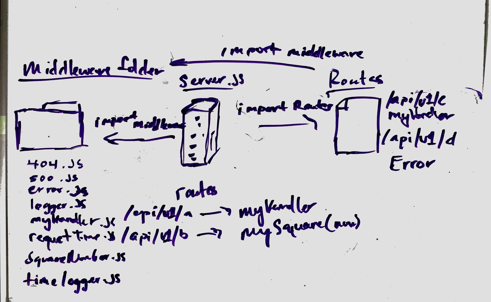

# LAB-07 

## MIDDLEWARE

### Author: Jeremy 

### Links and Resources
* [submission PR](https://github.com/jeremy-401-advanced-javascript/Lab07/pull/2)

### Modules
#### `404.js`
##### page not fond response
#### `500,js`
##### page error response
#### `errorOnD.js`
##### page error response on d route
#### `logger.js`
##### data logging response
#### `myHandler.js`
##### custom hanlder response
#### `requestTime.js`
##### request time response
#### `squareNumber.js`
##### response with sqaure number
#### `timeLogger.js`
##### time logger response

### Setup
#### `.env` requirements
* `PORT` - 8080

#### Running the app
* `nodemon`
* Endpoint: `:8080/api/v1/a`
  * Returns a `res.status(200).send('My handler request')`
* Endpoint: `:8080/api/v1/b`
  * Returns a `res.status(200).send(`Route B, ${req.number}`);`
* Endpoint: `:8080/api/v1/c`
  * Returns a `res.status(200).send('My handler request');`
* Endpoint: `:8080/api/v1/d`
  * Returns a `res.status(500).send(ERROR);`

#### UML

